# System Operations & User Flows — MovieStreamAR

> A comprehensive guide to the system architecture, component interactions, data flows, and user workflows.

---

## Table of Contents

1. [System Architecture Overview](#1-system-architecture-overview)
2. [Component Architecture](#2-component-architecture)
3. [Data Flow Architecture](#3-data-flow-architecture)
4. [User Flows](#4-user-flows)
   - [4.1 Authentication Flow](#41-authentication-flow)
   - [4.2 Movie & TV Series Browsing Flow](#42-movie--tv-series-browsing-flow)
   - [4.3 Search Flow](#43-search-flow)
   - [4.4 Movie Details Viewing Flow](#44-movie-details-viewing-flow)
   - [4.5 Watchlist Management Flow](#45-watchlist-management-flow)
   - [4.6 Language Switching Flow](#46-language-switching-flow)
   - [4.7 Contact Form Flow](#47-contact-form-flow)
5. [State Management Architecture](#5-state-management-architecture)
6. [Route Structure](#6-route-structure)
7. [Firestore Data Model & Operations](#7-firestore-data-model--operations)

---

## 1. System Architecture Overview

MovieStreamAR follows a **hybrid architecture** combining:

- **Client-side rendering (CSR)** via React 19 with Vite as the build tool
- **Server state management** via TanStack React Query (TMDB API data with caching)
- **Client state management** via Redux Toolkit (auth, UI state, search queries)
- **Backend-as-a-Service** via Firebase (Authentication + Firestore for watchlist persistence)
- **Third-party services** via TMDB API (movie/TV data), EmailJS (contact form)

### High-Level Architecture Diagram

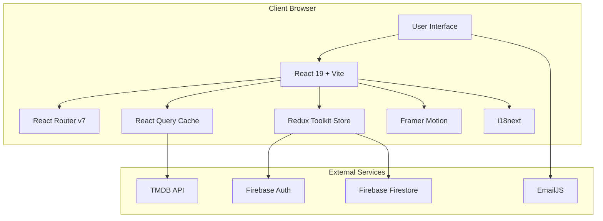

### Layer Breakdown

| Layer | Technology | Responsibility |
|---|---|---|
| **Presentation** | React 19, Framer Motion, Swiper, Bootstrap 5 | Rendering UI, animations, responsive layout, hero carousels |
| **Routing** | React Router v7 | Client-side navigation, nested layouts, lazy loading, search params |
| **State (Client)** | Redux Toolkit (5 slices) | Auth state, search queries, window properties, watchlist data |
| **State (Server)** | TanStack React Query v5 | TMDB API data fetching, caching, refetching, staleTime management |
| **API Layer** | Axios, Firebase SDK | HTTP requests to TMDB, Firestore CRUD, Firebase Auth |
| **External** | TMDB, Firebase, EmailJS | Movie/TV data, authentication, database, email notifications |

---

## 2. Component Architecture

### React Component Tree

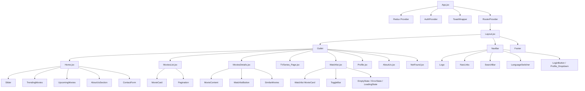

### Key Component Responsibilities

| Component | Responsibility |
|---|---|
| **App.jsx** | Root: initializes Redux Provider, AuthProvider, ToastWrapper, creates router |
| **Layout.jsx** | Shared shell: renders NavBar, Footer, scroll-to-top, window resize listener, page direction sync |
| **NavBar** | Navigation, search bar, language switcher, auth buttons, profile dropdown, mobile burger menu |
| **Slider** | Hero carousel with Swiper.js, Framer Motion captions, auto-play, RTL support |
| **AuthProvider** | Firebase `onAuthStateChanged` listener, redirect result handling, pending movie processing |
| **RequireAuth** | Route guard: shows MainLoader during auth check, login prompt if unauthenticated |
| **MovieCard** | Reusable card with responsive desktop/mobile descriptions, hover overlay, keyboard navigation |

---

## 3. Data Flow Architecture

### Data Flow Diagram

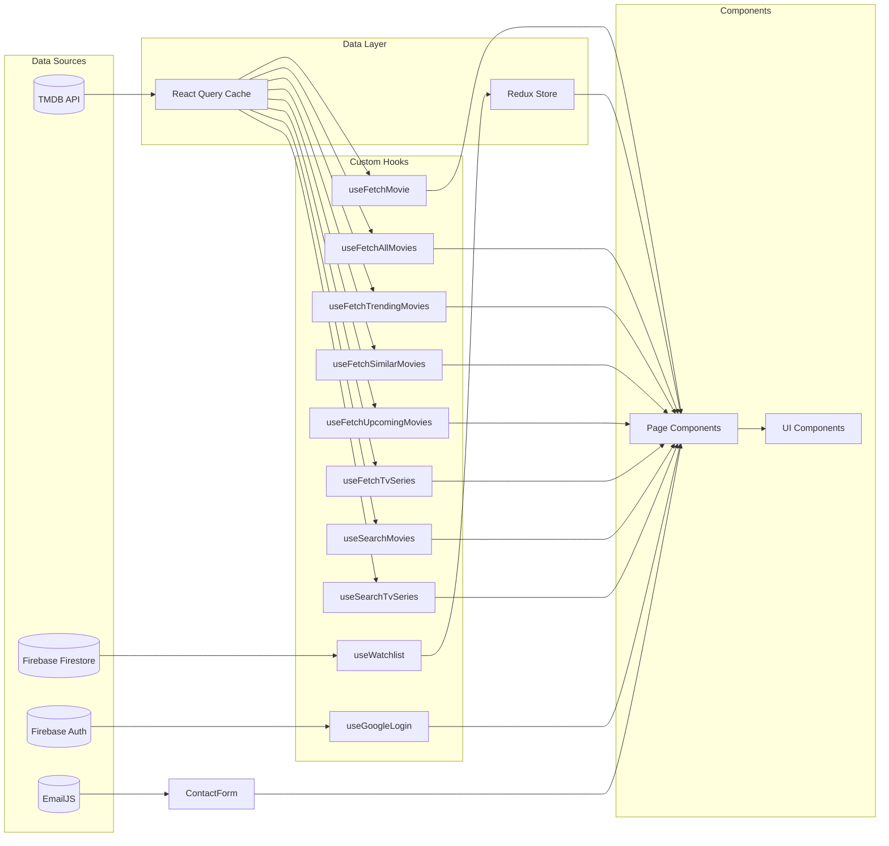

### Data Flow for a Typical Page Load (e.g., Movies List)

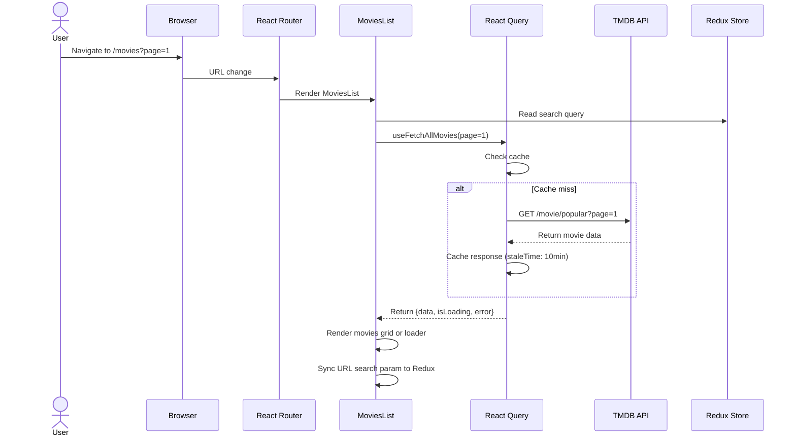

---

## 4. User Flows

### 4.1 Authentication Flow

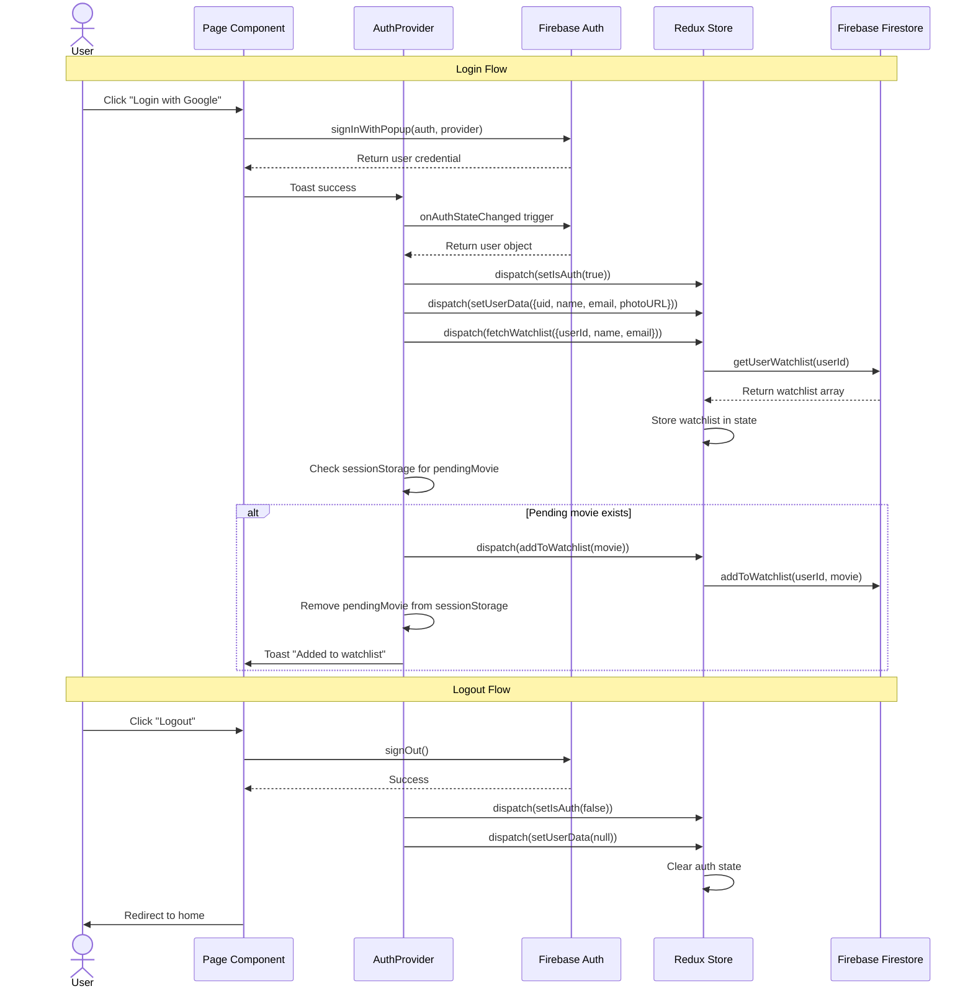

### 4.2 Movie & TV Series Browsing Flow

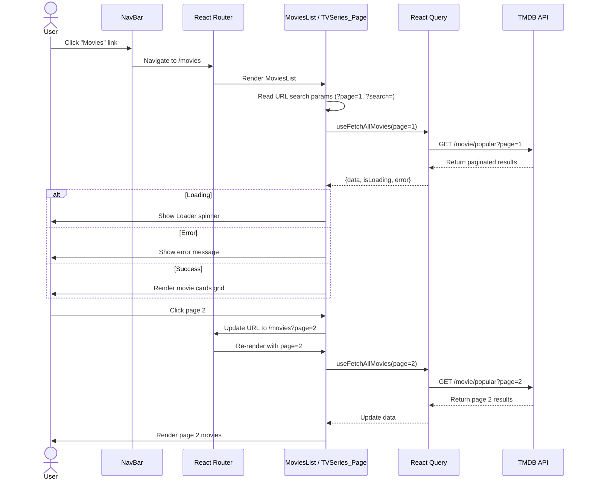

### 4.3 Search Flow

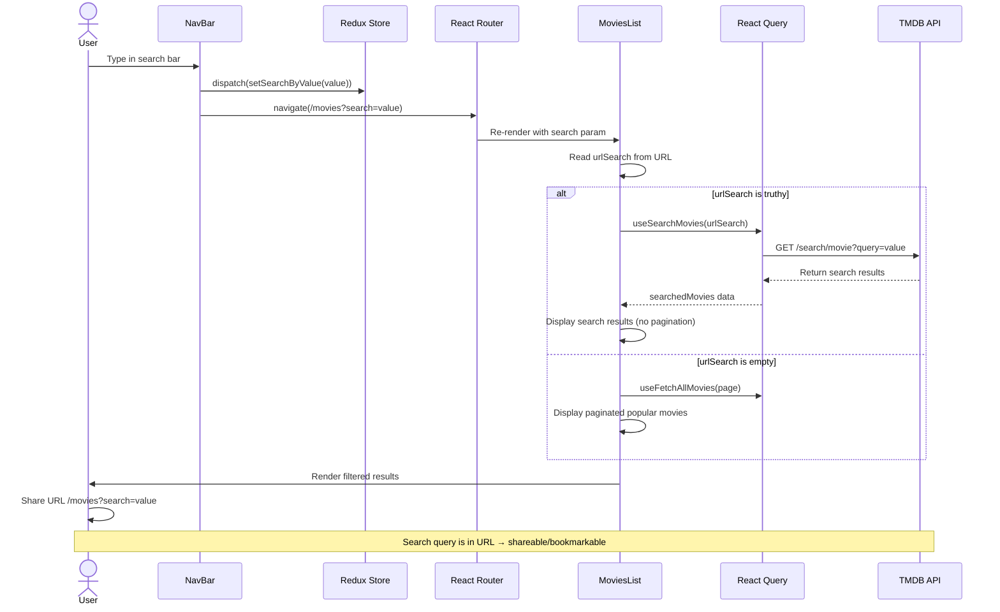

### 4.4 Movie Details Viewing Flow

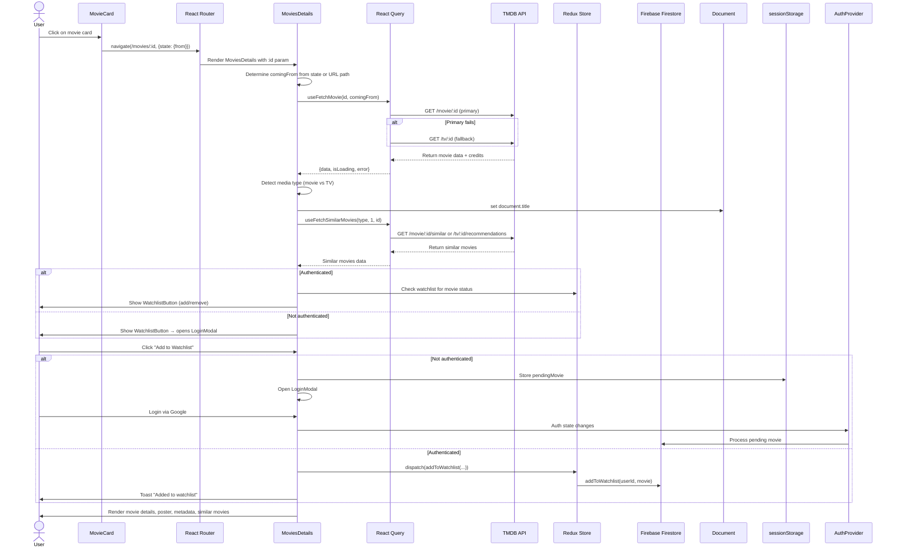

### 4.5 Watchlist Management Flow

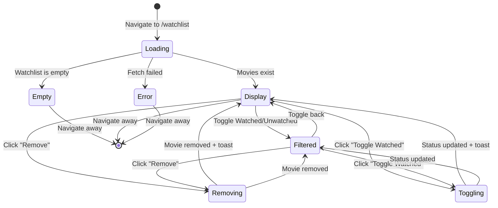

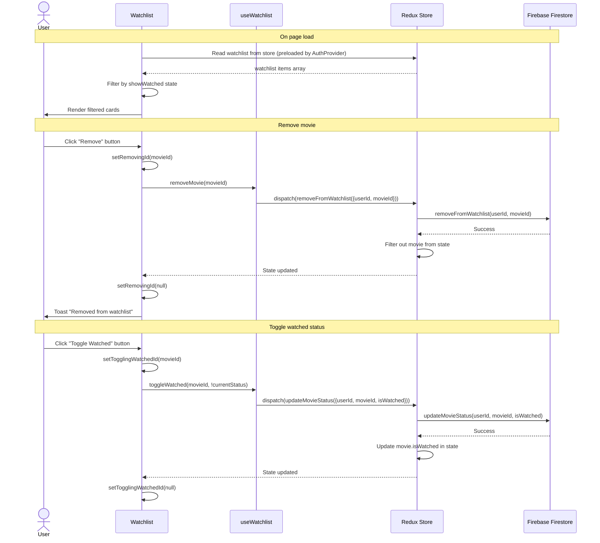

### 4.6 Language Switching Flow

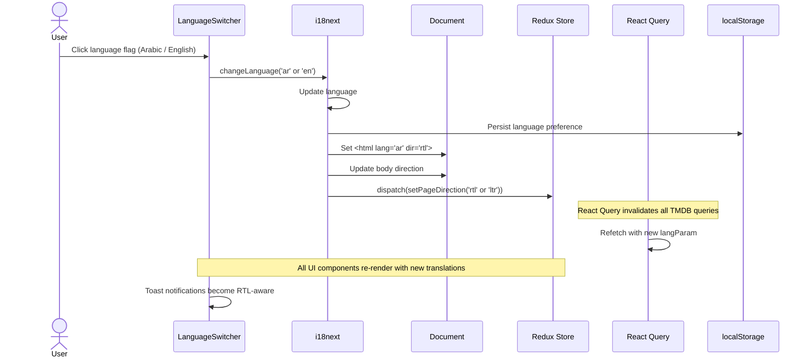

### 4.7 Contact Form Flow

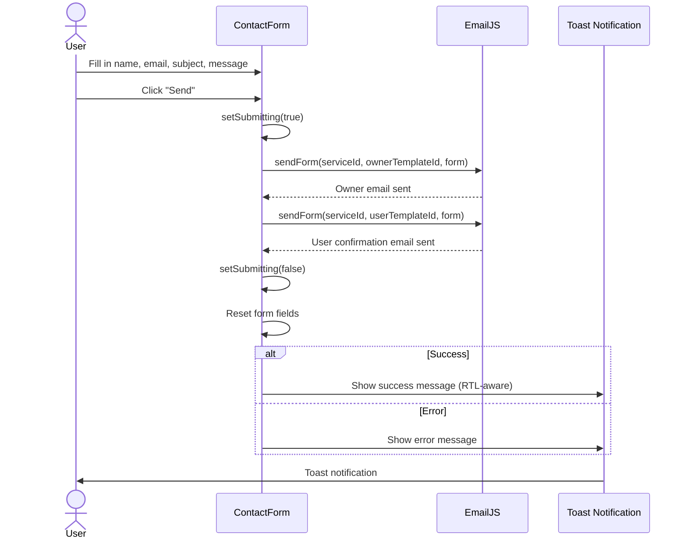

---

## 5. State Management Architecture

### Redux Store Structure

```mermaid
graph TB
    STORE[Redux Store]
    STORE --> AUTH[authSlice]
    STORE --> WL[watchlistSlice]
    STORE --> SM[searchMovies_Slice]
    STORE --> STV[searchTvSeries_Slice]
    STORE --> WP[windowSlice]
    
    AUTH --> A1[authLoading: boolean]
    AUTH --> A2[isAuth: boolean]
    AUTH --> A3[userData: {uid, displayName, email, photoURL, emailVerified}]
    
    WL --> W1[items: array]
    WL --> W2[loading: boolean]
    WL --> W3[error: string | null]
    WL --> W4[Async Thunks: fetchWatchlist, addToWatchlist, removeFromWatchlist, updateMovieStatus]
    
    SM --> S1[searchByValue: string]
    STV --> S2[searchByValue: string]
    
    WP --> P1[isLargeScreen: boolean]
    WP --> P2[page_direction: 'rtl' | 'ltr']
```

### React Query Cache Structure

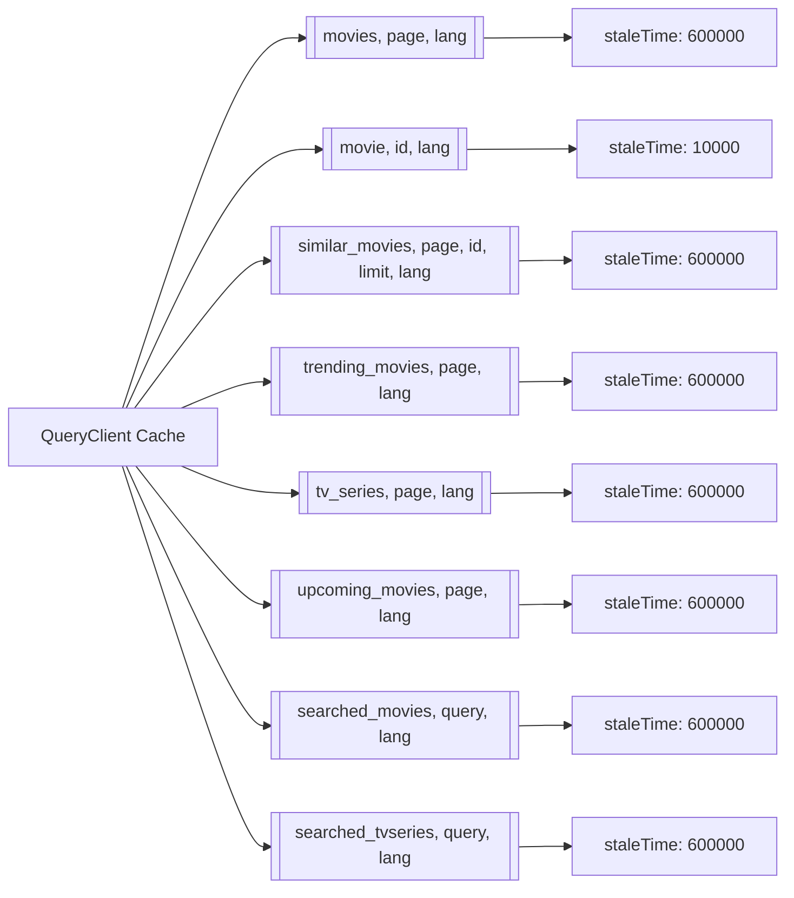

### State vs. Server Data Decision Flow

```mermaid
flowchart TD
    DATA{What type of data?}
    DATA -->|TMDB Movie/TV data| SERVER[Use React Query]
    DATA -->|User auth state| AUTH[Use Redux authSlice]
    DATA -->|Watchlist items| WL[Use Redux watchlistSlice]
    DATA -->|Search query text| SQ[Use Redux searchMovies_Slice or searchTvSeries_Slice]
    DATA -->|UI state (screen size, direction)| UI[Use Redux windowSlice]
    
    SERVER --> CACHE[Cache with staleTime]
    SERVER --> REFETCH[Auto-refetch on language change]
    SERVER --> PLACEHOLDER[Keep previous data during refetch]
    
    WL --> PERSIST[Sync with Firebase Firestore]
    WL --> ASYNC[Use createAsyncThunk for CRUD]
    
    SQ --> URL[Sync with URL search params]
```

---

## 6. Route Structure

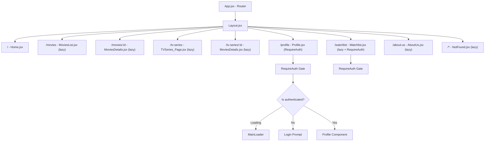

### Route Table

| Path | Component | Lazy? | Auth Required | Notes |
|---|---|---|---|---|
| `/` | Home | No | No | Hero slider, trending, upcoming, about, contact |
| `/movies` | MoviesList | Yes | No | Paginated grid, search via `?search=` |
| `/movies/:id` | MoviesDetails | Yes | No | Also handles `/tv-series/:id` via fallback |
| `/tv-series` | TVSeries_Page | Yes | No | Same pattern as MoviesList |
| `/tv-series/:id` | MoviesDetails | Yes | No | Same component as movies, detects TV |
| `/profile` | Profile | No | Yes | User info, logout |
| `/watchlist` | Watchlist | Yes | Yes | Watched/unwatched filter |
| `/about-us` | AboutUs | Yes | No | Developer info, values, contact |
| `*` | NotFound | Yes | No | 404 catch-all |

---

## 7. Firestore Data Model & Operations

### Database Schema

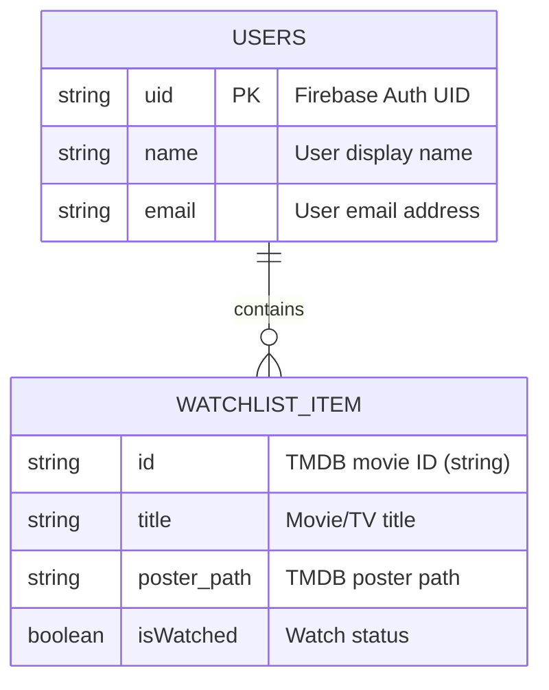

### Firestore CRUD Operation Details

| Operation | Firestore Method | Description |
|---|---|---|
| **Get Watchlist** | `getDoc(doc(db, "users", userId))` | Reads user document; auto-creates if not exists with `setDoc` |
| **Add Movie** | `arrayUnion(movie)` on `watchlist` field | Appends movie object to array |
| **Remove Movie** | `arrayRemove(movieObject)` on `watchlist` field | Finds exact object match and removes |
| **Toggle Status** | `updateDoc` with mapped array | Reads full array, maps to update target movie, writes back |

### Firestore Document Example

```json
{
  "users": {
    "abc123uid789": {
      "name": "Ahmed Maher",
      "email": "ahmed@example.com",
      "watchlist": [
        {
          "id": "550",
          "title": "Fight Club",
          "poster_path": "/pB8BM7pdSp6B6Ih7QZ4DrQ3PmJK.jpg",
          "isWatched": false
        },
        {
          "id": "680",
          "title": "Pulp Fiction",
          "poster_path": "/d5iIlFn5s0ImszYzBPb8JPIfbXD.jpg",
          "isWatched": true
        }
      ]
    }
  }
}
```

---

## Appendix: System Operation Logging

The application includes debug logging (removable) at key system points:

| Location | Log Event | Data Logged |
|---|---|---|
| `Layout.jsx` | Route change | Pathname, search, timestamp |
| `MoviesDetails.jsx` | Component lifecycle | Mount/unmount, id, comingFrom |
| `MoviesDetails.jsx` | Data fetch status | Loading/loaded/error states |
| `MoviesList.jsx` | Component lifecycle | Mount/unmount |
| `TVSeries_Page.jsx` | Component lifecycle | Mount/unmount |

---

*Document generated from codebase analysis — reflects the current implementation of MovieStreamAR v0.0.0*
